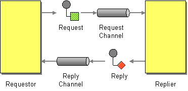

# Boilerplate of Golang micro-service with Kafka
The example of the GoLang project based on the microservices architecture which uses the Kafka Message Broker for communication

## Clean Architecture

Decouples Golang web service to independent layers, the changes from one layer won't affect codes of the others.
## Messaging Patterns

### Implement the Request-Reply pattern
In many cases, service needs to handle real-time synchronous requests from client or other microservices to support application's user experience. With Request-Reply pattern, each service will send request and wait for response from other services via different channels, in this case are different Kafka topics

## References
- [Enterprise Integration Patterns: Request-Reply](https://www.enterpriseintegrationpatterns.com/RequestReply.html)